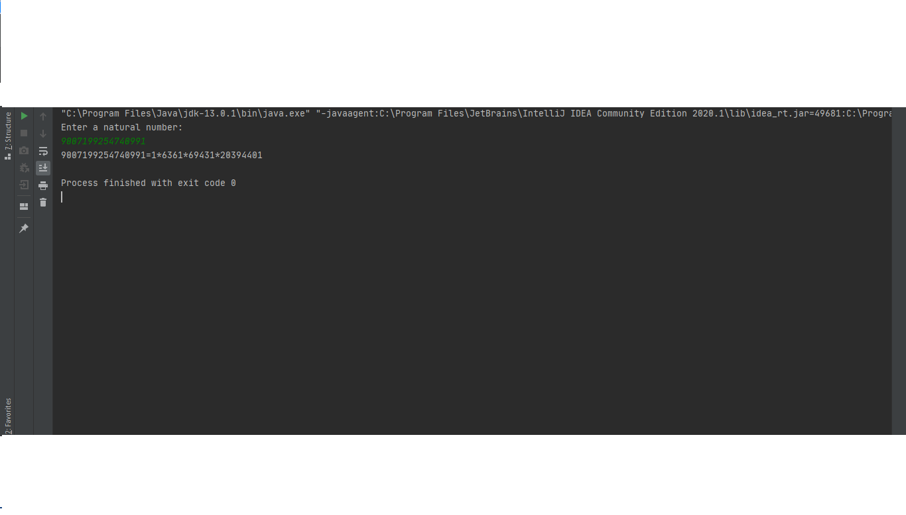

# Prime-factorization
Java program to find the prime factors of a number.This program good works for the whole range of long variable:
to 9223372036854775807. To run this program open file: Prime factorization.exe.

